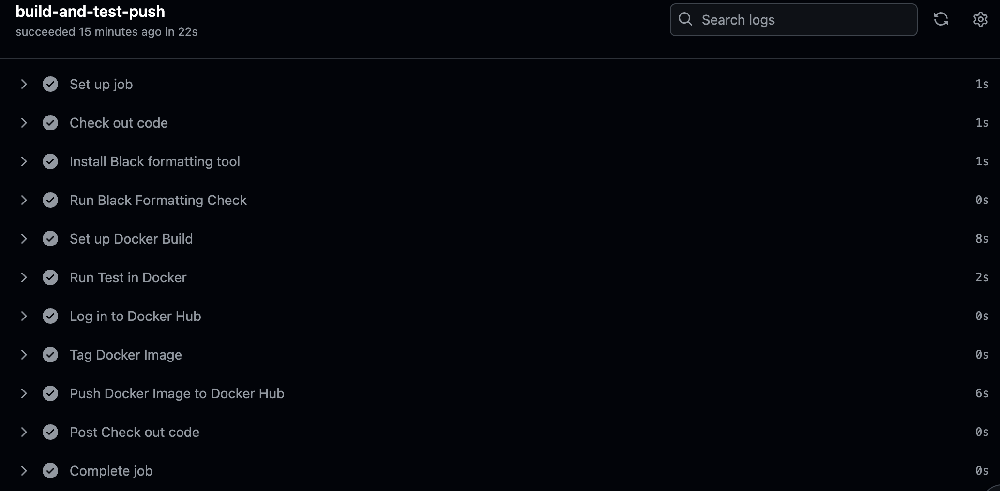
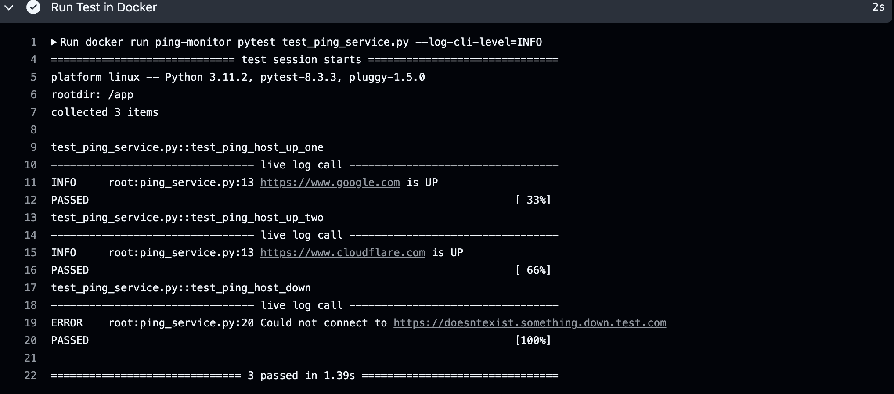
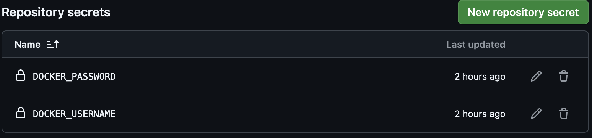

# Ping Monitor CI/CD Automation

## Overview

This project checks if network endpoints (URLs) are up and logs their status. I used it to practice Python, Docker, and setting up a CI/CD pipeline with GitHub Actions. It’s set up to run tests, check code quality, build a Docker image, and push it to Docker Hub.

## Key Features

- **CI/CD Pipeline**: Automatically checks formatting, runs tests, builds a Docker image, and pushes it to Docker Hub if everything passes.
- **Logging and Error Handling**: Logs whether endpoints are up or down, and catches errors for things like timeouts.
- **Dockerized Setup**: I set up a Dockerfile to make the app easy to run in different environments.

## Approach

1. **Building the App**: I started with `ping_service.py` to check if URLs were reachable and log the results. At first, I used an ICMP ping, but it didn’t work in GitHub Actions, so I switched to an HTTP-based check, which solved the issue.

2. **Dockerizing**: I created a Dockerfile to package everything so it can run consistently anywhere. The Dockerfile installs dependencies and sets the app to run by default.

3. **CI/CD Pipeline**: I set up GitHub Actions with these steps:
   - **Code Formatting**: I used `black` to keep the code style consistent.
   - **Testing**: Added `pytest` to run tests. I had to tweak the setup to make the log output visible in GitHub Actions, which was a bit tricky but worked out.
   - **Docker Push**: After tests pass, the pipeline builds the Docker image and pushes it to Docker Hub. Credentials are handled securely with GitHub Secrets.

## Project Screenshots

### 1. CI/CD Pipeline in GitHub Actions

*This screenshot shows the GitHub Actions CI/CD pipeline with each step successfully completed, including code formatting, testing, building, and pushing the Docker image.*

### 2. Test Logging Output

*Example logging output from tests, showing the status of each URL (UP or DOWN) and handling errors for unreachable URLs.*

### 3. Docker Hub Image Confirmation

*After successful testing, the Docker image is automatically pushed to Docker Hub, making it ready for deployment.*

### 4. GitHub Secrets for Secure Credentials

*GitHub Secrets are used to securely store sensitive information, such as Docker Hub credentials, ensuring that sensitive data is not exposed in the codebase or CI/CD pipeline.*

## Challenges and Lessons

- **Switching from ICMP to HTTP**: The ICMP ping didn’t work in GitHub Actions, so I swapped to HTTP requests, which ended up being more reliable in this setup.
- **Auto-formatting**: Adding `black` in the pipeline helped keep the code clean and readable.
- **Secure Credentials**: Using GitHub Secrets kept the Docker Hub login safe and out of the public repo.

## Future Improvements

1. **Environment Variables**: I’d use environment variables instead of hardcoding settings for more flexibility.
2. **Mocking Tests**: Replace live endpoint checks with mocked HTTP responses to avoid relying on external services.
3. **Kubernetes Deployment (Theoretical)**: I’d love to try deploying this on Kubernetes with Amazon EKS, but it’s a future goal.
